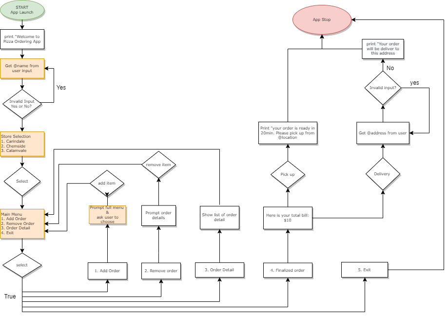
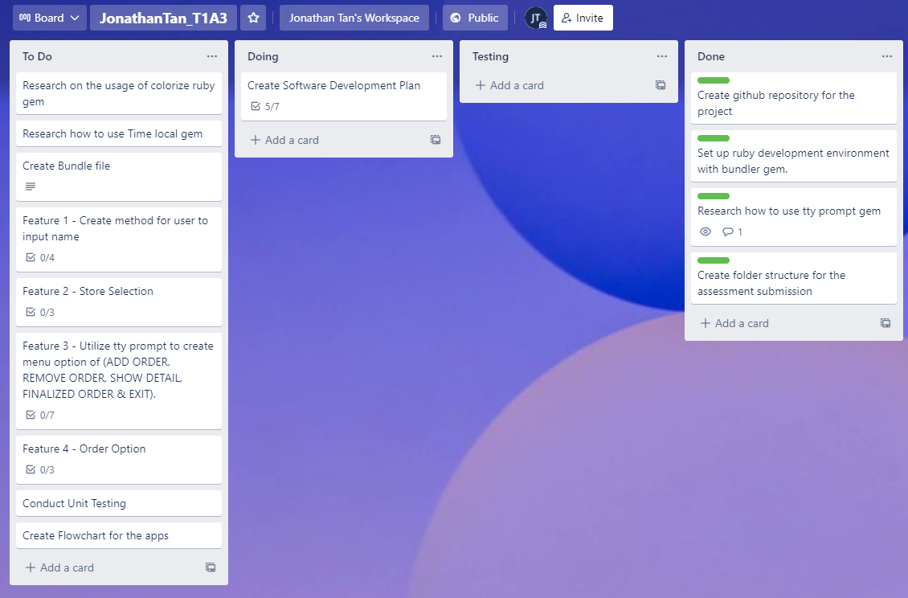
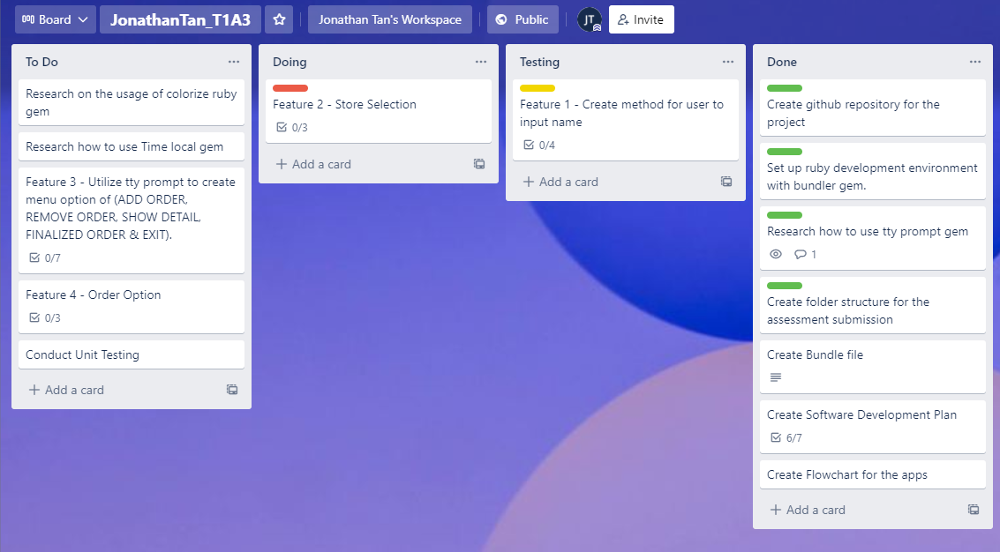
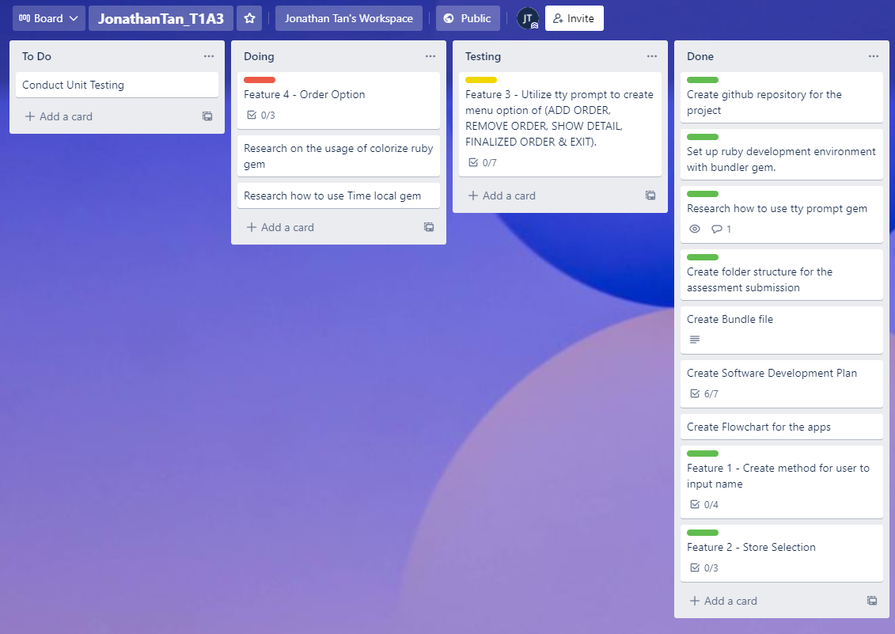
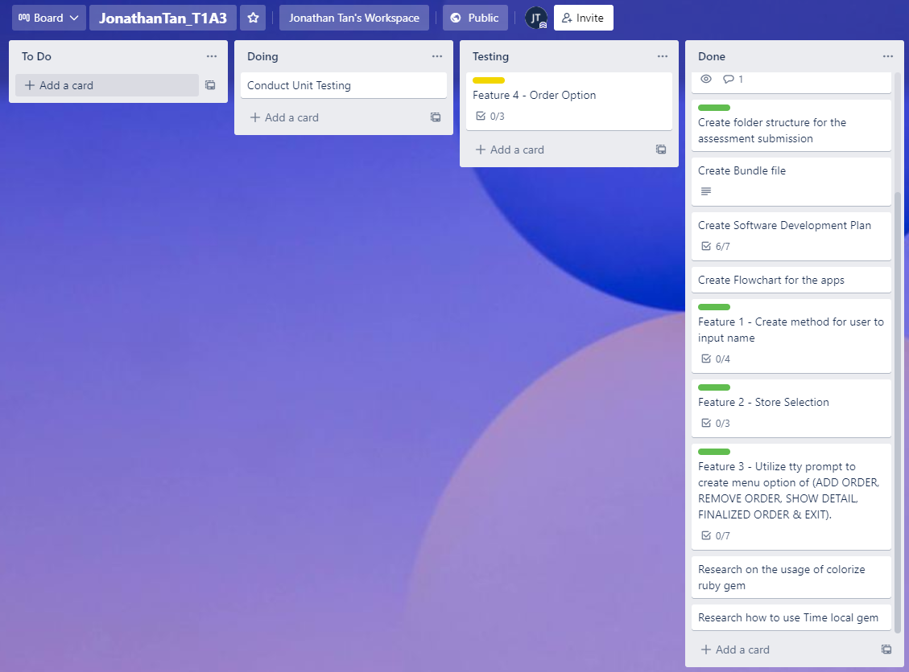

# Pizza Ordering App
This application is built on the ruby terminal to create an interactive experience for anyone to order pizza online.

The user will be able to choose the location of the store that is nearest to them and the ordering experience will begin from there.

<br>

# Software Development Plan
### Purpose and scope 
The purpose of this application is to provide easy access for users to order their pizza meal in a more efficient way by allowing them to order online then collect from the store when the order is ready, and the option of delivery directly to their door step is also available. Hence, this would save the users so much time without having to drive to the local store and wait for the order to be ready.

### Target Audience
The target audience of this application could be anyone that craves for a pizza meal and would like to have it quicker without having to quene up in line at the store.  

<br>

## List of Feature 

**Choose Name and location** - When the user launches the system, he/she will first be prompted to enter their name followed by four selection of location for the Pizza store that is nearest to them. 

**Menu Selection** - Once user had entered their name, the use will then be prompted with a list of menu with the following questions: Add Order, Remove Order, Show Details, Finalized order, Exit 

**Finalized order** - After the user completes their selection of items on the menu, the system will calculate and display the total cost for the selected items.

**Type of order option** - After the payment is finalized by the user, the system will then display two options for the user to select from. The system will ask the user if they would like to pick up their order or have the order to be delivered to them. If the user selects “Deliver”, the user will be prompted to enter their address for the delivery. The address will need to be the same suburbs as the store that the user selects at the beginning. Once the address has been confirmed, the system will then print “your order is currently being prepared for delivery” snooze for 4 second followed by print “Peter is delivering your pizza in white corolla”

<br>

## User interaction and experience
The application first prints the welcoming message and asks the user to enter their name followed by requiring the user to select the nearest pizza store (selection of only 4 local pizza stores). The system will then display a list of selection menus with ADD ORDER, REMOVE ORDER, SHOW DETAIL, FINALIZED ORDER, EXIT to the user. Users could select from the pizza menu by selecting ADD ORDER and REMOVE ORDER to their cart if necessary until they FINALIZED ORDER with the total amount displayed to the user. The user could always go back to SHOW DETAIL to view their cart along with the pricing with each pizza choice. Once FINALIZED ORDER. The system will then proceed to the order type by asking the option of PICK UP or DELIVERY. If the user selects PICK UP, the system will end the program and print the message asking the user to pick up their order from their chosen pizza local store. Else if they select DELIVERY, the program would display a message of the driver’s profile name and car model of the person who is delivering the orders and end the program.

<br>

## Control Flow Diagram
The diagram below describes the control flow of this terminal application.



<br>

## Implementation Plan
The following table summarizes the checklist item for each feature that is required in this project for the development. The Trello app is being used in this project to track the progress of the development. More in depth information for each tasks can be viewed in this link - 

Note: The images below are screenshots of the progress from the Trello app. [Link to my trello](https://trello.com/invite/b/sQgYue4C/c07be3b9f6c85e8646639e15e377ba82/jonathantant1a3) 

<br>

| Feature             | Task                                                                                                          |
| ------------------- | ------------------------------------------------------------------------------------------------------------- |
| Input First Name    | Create method of get_name in prompting users to input their first name.                                       |
|                     | Capitalized the name input by user.                                                                           |
|                     | Only accept characters as input, else raise errors                                                            |
|                     | Limiting the characters input by 10.                                                                          |
| Store Selection     | Create method of select_store and prints the 3 options for the user to choose.                                |
|                     | Utilize TTY prompt for the selection menu.                                                                    |
|                     | Create a loop in order to loop through the store and print the welcoming message                              |
| Main Menu           | Create method of print_selection for the main menu                                                            |
|                     | Utilize tty prompt to create menu option of (ADD ORDER, REMOVE ORDER, SHOW DETAIL, FINALIZED ORDER & EXIT).   |
|                     | Create a loop in order to loop through the menu and return the result.                                        |
|                     | Create method of add_order                                                                                    |
|                     | Create method of remove_order                                                                                 |
|                     | Create method of show_detail                                                                                  |
|                     | Create method of finalized order                                                                              |
| Order Option        | Create selection menu of PICK UP or Delivery with TTY Prompt.                                                 |
|                     | Create method of gets_time for printing the time after the next 15 minutes                                    |
|                     | Create method of clear() for clearing the system before prompting new results.                                |









<br>

## Help Documentation
Please follow the instructions below to install and run the application.

STEP 1: Install [Ruby](https://www.ruby-lang.org/en/documentation/installation/) on your system.

STEP 2: Install [Git](https://git-scm.com/downloads) on your system.

STEP 3: Clone the following repository to your system and change directory to your project folder.

```bash
git clone git@github.com:jonathan5057/JonathanTan_T1A3.git
cd JonathanTan_T1A3
```

STEP 4: Change directory to src

```bash
cd JonathanTan_T1A3/src
```

STEP 5: Run the Ruby Gem blunder and gem dependencies

```bash
./run_app.sh
```

STEP 6: Run the application

```bash
ruby main.rb
```

<br>

## Unit Test
Ruby Gem of [RSpec](https://rspec.info/) is being used for conducting the test. There are total of 4 unit tests were deployed in order to check if the application is running as expected. Please refer to the table below for the detailed summary of the tests. The souce code can be view from rspec.rb ruby file. 

| Number | Feature                              | Test                                                            | Expectation  | Actual       | Result |
| ------ | ------------------------------------ | --------------------------------------------------------------- | ------------ | ------------ | ------ |
| 1      | User input name                      | should return true if length longer than 10                     | invalid name | invalid name | pass   |
| 2      | User input name                      | should return true if blank                                     | invalid name | invalid name | pass   |
| 3      | User input name                      | should return true if contains digit                            | invalid name | invalid name | pass   |
| 4      | pizza Menu check                     | should return available menu                                    | match        | match        | pass   |